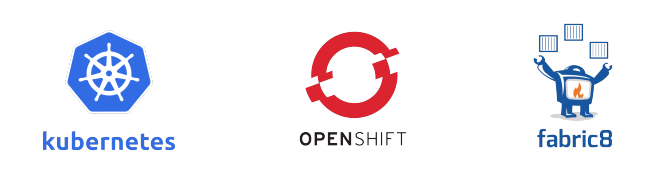
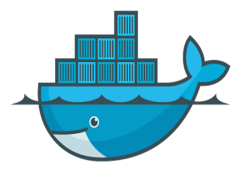

include::includes/_settings.adoc[]

:revealjs_theme: sobkowiak-cg
:speaker: Krzysztof Sobkowiak (http://twitter.com/ksobkowiak[@ksobkowiak])
:speaker-title: The Apache Software Foundation Member, Senior Solution Architect at Capgemini
:speaker-email: krzys.sobkowiak@gmail.com
:speaker-blog: http://sobkowiak.github.io
:speaker-twitter: http://twitter.com/ksobkowiak[@ksobkowiak]

= Fabric8 your Services on Kubernetes & OpenShift
// = Microservices Orchestration with Kubernetes & OpenShift
//= Microservices Powered by Kubernetes & OpenShift

[.cover]
--

[.event]
Capgemini APPS Evolve! / Architects and Software Engineers Summit 2017 +
Mörfelden, 24th of March 2017

[.newline]
{speaker}
[.speaker-title]
The Apache Software Foundation Member +
Senior Solution Architect at Capgemini
[.logo-left]
image:{template-images-dir}/feather.png[width="60", link="http://apache.org"]
--

// ***************************************************************************
include::includes/about.adoc[]
include::includes/disclaimer-cg.adoc[]
// ***************************************************************************

// ----------------------------------------------------------------------------

== !

image::images/turbo-camel.png[align="center"]

// ----------------------------------------------------------------------------

=== !

[.medium-text]
Creating business value through software is about speed, safety, iteration, and continuous improvement

// ----------------------------------------------------------------------------

=== !

[.noredheader,cols="38%,4%,58%"]
|===
^.^| image:images/java-microservices-frameworks.png[]
a|
.^a|
* Simple configuration
* Curated dependencies and transitive dependencies
* Built in metrics, monitoring
* Slim profile for deployment (...micro even?)
+
#microprofile
|
|===

// ----------------------------------------------------------------------------

=== !

[.noredheader,cols="48%,4%,48%"]
|===
^.^| image:images/netflix-java-logo.png[width="70%"]
a|
.^a|
* Distributed configuration
* Service Discovery
* Loadbalancing
* Circuit Breakers
* Bulkheading
* Versioning/Routing
* Based on AWS
|
|===
// ----------------------------------------------------------------------------

=== !

// ----------------------------------------------------------------------------
=== What about non-java?

image::images/non-java-languages.png[align="center", width="50%"]

// ***************************************************************************
include::includes/qa-simple.adoc[]
include::includes/license-cg.adoc[]
//include::includes/credits.adoc[]
// ***************************************************************************
